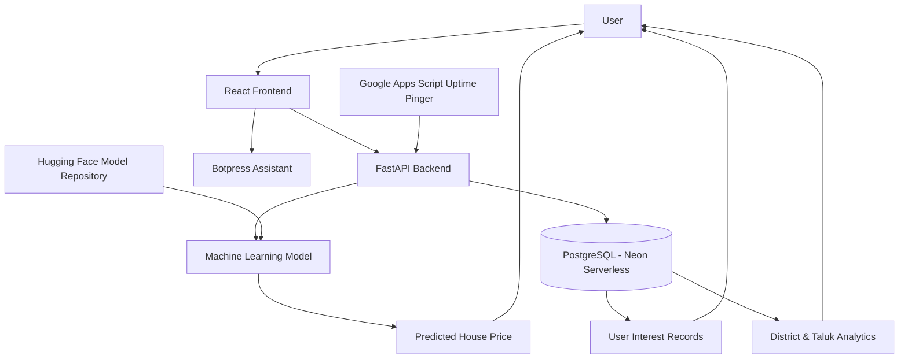

# 🏠 Tamil Nadu House Prices – Full Stack Machine Learning Web Application

A full-stack machine learning web application that predicts residential property prices across Tamil Nadu districts using user-provided housing characteristics. The project combines machine learning, cloud deployment, modern web development, database integration, and housing-interest analytics into a complete end-to-end system.

The platform enables users to estimate property prices while simultaneously contributing anonymous housing-interest data that can be aggregated to visualize demand trends across districts and taluks of Tamil Nadu.

---

## 🌐 Live Demo

**Web Application**

https://chennai-house-prices-1.onrender.com/

---

## 🤖 Machine Learning Model

**Hugging Face Model Repository**

https://huggingface.co/runeking2006/tamilnadu-house-prices

The trained model is deployed separately and serves real-time house-price predictions through the FastAPI backend.

---

## 📂 Open Source Resources

The project follows an open-source approach to encourage transparency, reproducibility, and learning.

### Model Repository

Hosted on Hugging Face.

### Dataset Repository

Available on:

* Hugging Face[https://huggingface.co/datasets/runeking2006/ROUGH_TAMIL_NADU_HOUSING_DATASET]
* Kaggle[https://www.kaggle.com/datasets/runeking2006/rough-tamil-nadu-housing-dataset]

These resources allow developers, students, and researchers to explore the training data, validate results, and extend the project further.

---

## ✨ Key Features

* Real-time house price prediction
* Tamil Nadu district-based estimation
* FastAPI-powered prediction API
* React frontend interface
* PostgreSQL data storage
* Housing-interest analytics
* District and taluk demand tracking
* Botpress virtual assistant integration
* Cloud deployment on Render
* Hugging Face model hosting
* Automated uptime maintenance

---

## 🏗️ System Architecture

---

## 🛠️ Technology Stack

### Frontend

* React.js
* JavaScript
* HTML5
* CSS3

### Backend

* FastAPI
* Python

### Database

* PostgreSQL
* Neon Serverless PostgreSQL

### Machine Learning

* Scikit-Learn
* Pandas
* NumPy

### Cloud & Deployment

* Render
* Hugging Face

### Additional Services

* Botpress
* Google Apps Script

---

## 📊 Housing Interest Analytics

Beyond property-price estimation, the application records location preferences submitted by users.

These records are aggregated to generate:

* District-wise housing interest trends
* Taluk-level demand distribution
* Regional popularity indicators
* Historical interest insights

This additional analytical layer transforms the application from a standalone prediction tool into a platform capable of visualizing housing-interest patterns across Tamil Nadu.

---

## 💬 Chatbot Integration

The application includes a Botpress-powered assistant that acts as an interactive guide for users.

The chatbot helps visitors:

* Understand application features
* Navigate prediction inputs
* Learn about housing-interest analytics
* Improve overall usability for first-time users

---

## 🔄 Model Lifecycle Approach

The deployed model follows a stable and reproducible deployment strategy.

During project development, the most comprehensive publicly available district-wise valuation references from Tamil Nadu were used to build the dataset. Statewide valuation data of comparable coverage is published infrequently, making high-quality retraining cycles dependent on the availability of updated authoritative datasets.

To maintain consistency and reliability, the project prioritizes training on verified and consolidated data sources rather than introducing frequent retraining using fragmented or incomplete datasets.

Future model updates can be incorporated whenever sufficiently comprehensive and trustworthy valuation datasets become available.

---

## 🎯 Project Scope

The primary objective of this project is to demonstrate the practical integration of machine learning with modern full-stack technologies.

The development effort focuses on:

* Machine learning deployment
* Prediction serving
* Database integration
* Housing-interest analytics
* Cloud infrastructure
* End-to-end application deployment

The resulting architecture remains lightweight, accessible, and centered on delivering accurate predictions and meaningful analytical insights.

---

## ⚙️ Configuration

The application uses environment-based configuration and deployment settings through configuration files and environment variables.

Configuration areas include:

* Database connections
* Backend settings
* Deployment parameters
* Model integration
* External service integration

This structure enables portability across development and production environments while maintaining clean project organization.

---

## 🚀 Deployment

### Frontend

* Render

### Backend

* Render

### Database

* Neon Serverless PostgreSQL

### Model Hosting

* Hugging Face

### Uptime Management

* Google Apps Script Pinger

---

## 📁 Project Workflow

1. User enters housing details.
2. React frontend sends request to FastAPI backend.
3. Backend retrieves the deployed machine learning model.
4. Model generates house-price prediction.
5. Prediction is returned to the frontend.
6. User interest data is stored in PostgreSQL.
7. Aggregated records contribute to district and taluk demand analytics.
8. Botpress assistant provides user guidance throughout the workflow.

---

## 🎓 Academic Purpose

This project was developed as a full-stack machine learning mini project to demonstrate:

* Machine learning model deployment
* API development using FastAPI
* Modern frontend development with React
* Cloud database integration
* Production deployment practices
* Real-world data-driven application design

The project showcases how machine learning systems can be transformed into complete web applications that deliver practical value while maintaining scalability, accessibility, and transparency.

---

## 📜 License

This project is intended for educational, research, and learning purposes. Contributions, experimentation, and further development are encouraged through the publicly available repositories and datasets.
